# U-Noise - PyTorch Implementation

[**U-Noise: Learnable Noise Masks for Interpretable Image
Segmentation**](https://arxiv.org/abs/2101.05791)<br>
Teddy Koker, Fatemehsadat Mireshghallah, Tom Titcombe, Georgios Kaissis

Image + Mask | U-Noise Large | Occlusion Sensitivity | Grad-CAM
---          | ---           | ---                   | ---
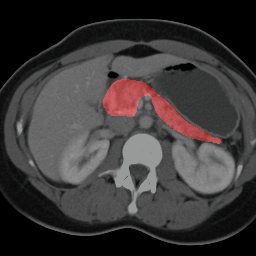 | 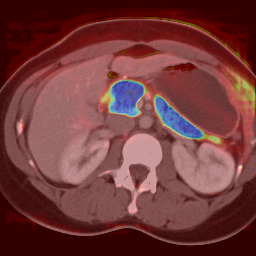 | 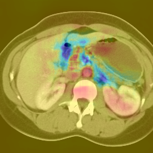 | 
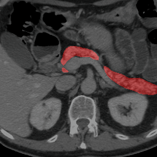 | 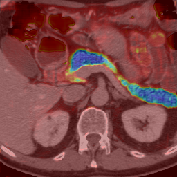 | 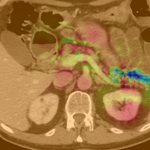 | 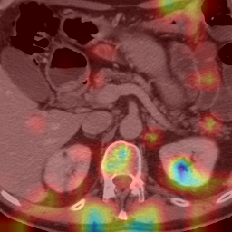
 | 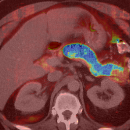 | 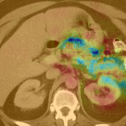 | 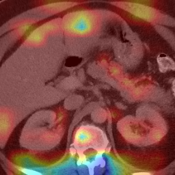
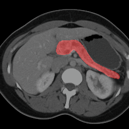 | 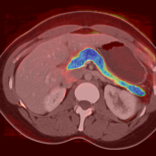 | 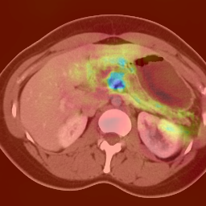 | 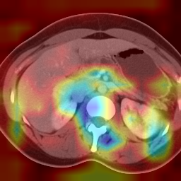

## Download Data/Pre-trained Models

```bash
./download.sh
```

This will download the following files:
```
data
├── bounding_boxes.npy  # bounding boxes of pancreas (unused)
├── images.npy          # scans
├── labels.npy          # label (whether contains pancreas)
└── masks.npy           # ground truth pancreas mask

models
├── unoise_small.ckpt   # small U-Noise model
├── unoise_medium.ckpt  # medium U-Noise model
├── unoise_large.ckpt   # large U-Noise model TODO
├── unoise_small_pretrained.ckpt  # small U-Noise model pretrained TODO 
├── unoise_medium_pretrained.ckpt # medium U-Noise model pretrained TODO
├── unoise_large_pretrained.ckpt  # large U-Noise model pretrained TODO
└── utility.ckpt        # pretrained utility model
```

Alternatively, each model can be downloaded individually:

*Note: each U-Noise model contains a copy of the utility model*

Model          | # parameters | weights
---            | ---          | ---
Utility        | 34M          | [utility.ckpt](https://drive.google.com/file/d/1uXsgpJSOiKfIe1haqoRchx-AMRF9ormK/view?usp=sharing)
U-Noise Small  | 10K          | [unoise_small.ckpt](https://drive.google.com/file/d/1FEy61tSQzYF10e0N8xNENs0a0Rv0UMPv/view?usp=sharing)
U-Noise Medium | 130K         | [unoise_medium.ckpt](https://drive.google.com/file/d/11_rTHLkB56QIlPXTlRb7ln9WURbbAUDD/view?usp=sharing)
U-Noise Large  | 537K         | [unoise_large.ckpt](https://drive.google.com/file/d/1evV2daEgnfbyctwCkQ5PHXhZT8LNsidr/view?usp=sharing)
U-Noise Small  (pretrained)| 10K  | [unoise_small_pretrained.ckpt](https://drive.google.com/file/d/1kzR1I_lgynPtqEQqwaHiVdmQKghSi2bv/view?usp=sharing)
U-Noise Medium (pretrained)| 130K | [unoise_medium_pretrained.ckpt](https://drive.google.com/file/d/1xdJH9jcRZoVa6i_mdKCfbjyPQQrMbLac/view?usp=sharing)
U-Noise Large (pretrained) | 537K | [unoise_large_pretrained.ckpt](https://drive.google.com/file/d/1834JqlUcxeS3ifAnTjiCGHvP3GYST7Bl/view?usp=sharing)

U-Nets       | Params | Depth | Channels
---          | ---    | ---   | ---
Utility      | 34M    | 5     | 1, 64, 128, 256, 512, 1024, 512, ...
Small        | 28K    | 2     | 1, 16, 32, 16, 1
Medium       | 130K   | 3     | 1, 16, 32, 64, 32, 16, 1
Medium       | 537K   | 4     | 1, 16, 32, 64, 128, 64, 32, 16, 1

## Reproducing Results

Train **Utility** model (~5 hours on NVIDIA 2070 Super):
```bash
python src/train_util.py
```

Train **U-Noise Small**:
```bash
python src/train_noise.py --depth 2 --channel_factor 4 --batch_size 8
```           

Train **U-Noise Medium**:
```bash
python src/train_noise.py --depth 3 --channel_factor 4 --batch_size 8
```            

Train **U-Noise Large**:
```bash
python src/train_noise.py --depth 4 --channel_factor 4 --batch_size 8
```            

Train **U-Noise Small (Pretrained)**:
```bash
python src/train_util.py --depth 2 --channel_factor 4 --batch_size 8
python src/train_noise.py --depth 2 --channel_factor 4 --batch_size 8 \
 --pretrained /path/to/pretrained --learning_rate 1e-3
```            

Train **U-Noise Medium (Pretrained)**:
```bash
python src/train_util.py --depth 3 --channel_factor 4 --batch_size 8
python src/train_noise.py --depth 3 --channel_factor 4 --batch_size 8 \
 --pretrained /path/to/pretrained --learning_rate 1e-3
```            

Train **U-Noise Large (Pretrained)**:
```bash
python src/train_util.py --depth 4 --channel_factor 4 --batch_size 8
python src/train_noise.py --depth 4 --channel_factor 4 --batch_size 8 \
 --pretrained /path/to/pretrained --learning_rate 1e-3
```            

## Citation

If you found this work helpful, please cite:

```
@misc{koker2021unoise,
      title={U-Noise: Learnable Noise Masks for Interpretable Image Segmentation}, 
      author={Teddy Koker and Fatemehsadat Mireshghallah and Tom Titcombe and Georgios Kaissis},
      year={2021},
      eprint={2101.05791},
      archivePrefix={arXiv},
      primaryClass={cs.CV}
}
```           
